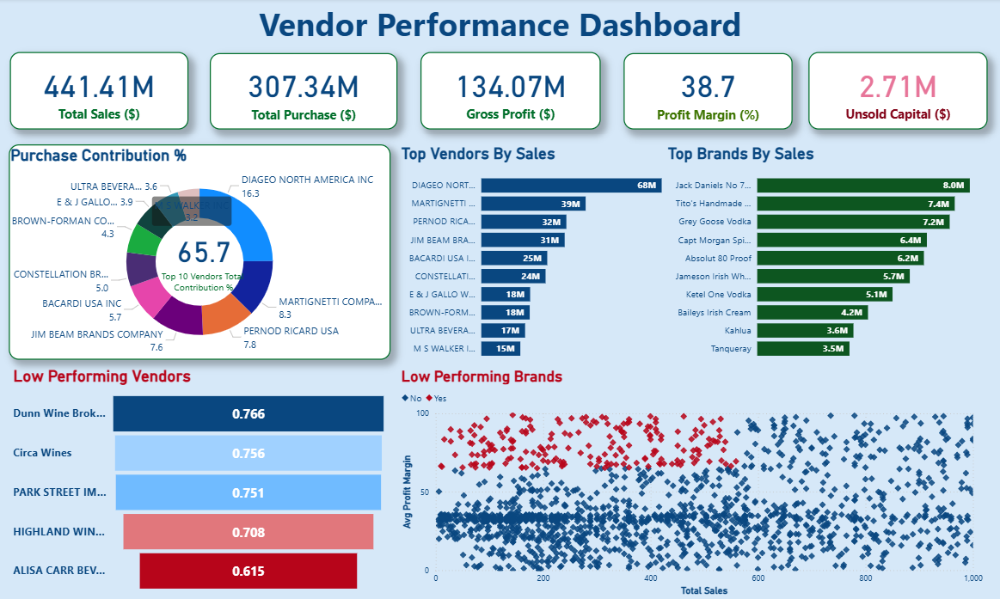

# Vendor Performance Analysis 📊

## Overview
This project analyzes vendor sales, profitability, and inventory performance to support data-driven decision making in a retail/wholesale business context. The analysis focuses on identifying top vendors, pricing inefficiencies, inventory risks, and opportunities for cost optimization.

---

## Business Problem
Efficient inventory and vendor management are critical for maximizing profitability. Businesses often face challenges such as:
- Over-reliance on a few vendors
- Slow-moving or unsold inventory
- Inefficient pricing strategies
- High procurement and logistics costs

This project aims to address these challenges using data analysis and visualization.

---

## Objectives
- Identify top-performing and underperforming vendors
- Analyze sales contribution and vendor dependency
- Evaluate the impact of bulk purchasing on unit cost
- Measure inventory turnover and unsold inventory value
- Compare profit margins using statistical hypothesis testing

---

## Dataset
- **Source:** Vendor sales and purchase summary data  
- **Records:** 10,000+ rows  
- **Key Features:**
  - Purchase Price, Actual Price
  - Sales Quantity & Sales Revenue
  - Gross Profit & Profit Margin
  - Freight Cost
  - Inventory Turnover Metrics

---

## Tools & Technologies
- **Python:** Pandas, NumPy
- **Visualization:** Matplotlib, Seaborn
- **Statistics:** SciPy (Hypothesis Testing)
- **BI Tool:** Power BI
- **Environment:** Jupyter Notebook

---

## Analysis Performed
- Exploratory Data Analysis (EDA)
- Data cleaning and filtering of invalid records
- Correlation analysis
- Vendor contribution analysis
- Inventory turnover and unsold stock analysis
- Profit margin comparison using t-test

---

## Key Insights
- Top 10 vendors contribute ~66% of total purchases, indicating vendor dependency risk
- Bulk purchasing reduces unit cost by ~72%
- ~$2.7M worth of inventory remains unsold due to low turnover
- Low-performing vendors show higher margins but lower sales volume
- Statistical testing confirms significant profit margin differences between vendor groups

---

## Power BI Dashboard
The dashboard provides an interactive view of vendor performance, sales trends, profitability, and inventory risks.

---

## Repository Structure
Vendor-Performance-Data-Analysis/
- │
- ├── notebooks/ # Jupyter notebooks with full analysis
- ├── data/ # Dataset used for analysis
- ├── report/ # Final PDF report
- ├── dashboard/ # Power BI dashboard screenshots
- ├── README.md
- └── requirements.txt

---

## Business Impact
- Helps identify vendors for renegotiation or diversification
- Supports pricing and promotion decisions
- Improves inventory planning and cash flow efficiency
- Enables stakeholders to monitor KPIs through Power BI dashboards

---

## Conclusion
This project demonstrates how data analytics and visualization can drive better vendor management, reduce costs, and improve overall operational efficiency.
